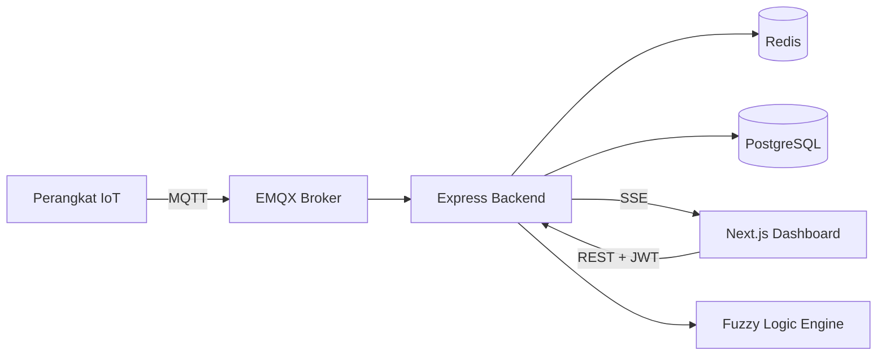

# Subur.in by Capstone E-04 2026

**Platform monitoring & rekomendasi tanaman pintar berbasis IoT dan Fuzzy Logic.**

Subur.in memantau pH dan kelembapan tanah secara real-time lewat sensor IoT, lalu menghasilkan rekomendasi perawatan (penyiraman, kapur dolomit, sulfur elemental) yang dihitung secara dinamis menggunakan mesin inferensi fuzzy logic Mamdani — disesuaikan dengan jenis tanaman dan ukuran media tanam yang digunakan.

[](LICENSE)


---

## Fitur Utama

- 🌱 **Monitoring Real-Time** — pH & kelembapan tanah dari perangkat IoT, di-streaming ke dashboard lewat Server-Sent Events.
- 🧠 **Rekomendasi Berbasis Fuzzy Logic** — mesin inferensi Mamdani menerjemahkan kondisi tanah menjadi aksi konkret: volume air, dosis kapur, atau dosis sulfur, dipersonalisasi per tanaman dan per ukuran polybag.
- 🔐 **Login dengan Google** — autentikasi OAuth2 tanpa kelola password, disinkronkan ke sesi JWT backend.
- 📊 **Riwayat & Analitik** — riwayat rekomendasi dan grafik histori sensor per perangkat.
- 🔔 **Notifikasi Otomatis** — peringatan real-time saat data sensor tidak valid atau perangkat bermasalah.
- 📡 **Manajemen Perangkat** — klaim perangkat baru yang terdeteksi, atur interval pengiriman data, dan kelola beberapa perangkat sekaligus.

## Tech Stack

| Layer         | Teknologi                                                                   |
| ------------- | --------------------------------------------------------------------------- |
| Frontend      | Next.js 16 (App Router), TypeScript, Tailwind CSS v4, NextAuth v5, Recharts |
| Backend       | Node.js, Express.js, Prisma ORM                                             |
| Database      | PostgreSQL (Supabase)                                                       |
| Cache         | Redis (Upstash)                                                             |
| Pesan IoT     | MQTT (EMQX Cloud, TLS)                                                      |
| Realtime Web  | Server-Sent Events (SSE)                                                    |
| Observability | Prometheus (`prom-client`)                                                  |
| Deployment    | Docker, GitHub Actions, GHCR, VPS                                           |

## Arsitektur Singkat



Detail lengkap ada di [`docs/architecture/system-design.md`](docs/architecture/system-design.md).

## Struktur Proyek

```
Subur.in/
├── backend/     # API Express + mesin fuzzy logic + integrasi MQTT/Redis
├── frontend/    # Dashboard Next.js
├── docs/        # Dokumentasi lengkap (lihat di bawah)
└── docker-compose.yml
```

Rincian folder: [`docs/architecture/folder-structure.md`](docs/architecture/folder-structure.md).

## Mulai Cepat

Butuh Node.js 18+, PostgreSQL, Redis, broker MQTT, dan Google OAuth Client ID. Panduan lengkap: [`docs/setup/installation.md`](docs/setup/installation.md).

```bash
git clone https://github.com/Capstone2026-E04/Subur.in.git
cd Subur.in

# Backend
cd backend && npm install
cp .env.example .env   # isi sesuai docs/setup/environment.md
npx prisma generate && npx prisma db push && npm run db:seed
npm run dev             # http://localhost:3000

# Frontend (terminal baru)
cd frontend && npm install
cp .env.example .env.local
npm run dev              # http://localhost:3001
```

## Dokumentasi

Dokumentasi lengkap ada di [`docs/`](docs/), terbagi per topik:

| Topik                                | Deskripsi                                                                                                         |
| ------------------------------------ | ----------------------------------------------------------------------------------------------------------------- |
| [`architecture/`](docs/architecture) | Desain sistem, struktur folder, skema database, alur API                                                          |
| [`api/`](docs/api)                   | Referensi endpoint per resource (auth, users, devices, plants, polybags, recommendations, sensors, notifications) |
| [`setup/`](docs/setup)               | Instalasi, environment variable, deployment, troubleshooting                                                      |
| [`frontend/`](docs/frontend)         | Design system, komponen, routing, state management                                                                |
| [`backend/`](docs/backend)           | Coding standards, validasi, autentikasi, logging                                                                  |
| [`database/`](docs/database)         | Konvensi Prisma, migrasi, seeding                                                                                 |
| [`decisions/`](docs/decisions)       | Catatan keputusan teknis (ADR)                                                                                    |
| [`changelog.md`](docs/changelog.md)  | Riwayat perubahan                                                                                                 |

## Kontribusi

Repo ini dikembangkan oleh tim **Capstone2026-E04**. Ikuti konvensi yang sudah didokumentasikan di [`docs/backend/coding-standards.md`](docs/backend/coding-standards.md) dan [`docs/frontend/components.md`](docs/frontend/components.md) saat menambah kode baru.

## Lisensi

[MIT](LICENSE) © 2026 Subur.in by Capstone E04 2026
