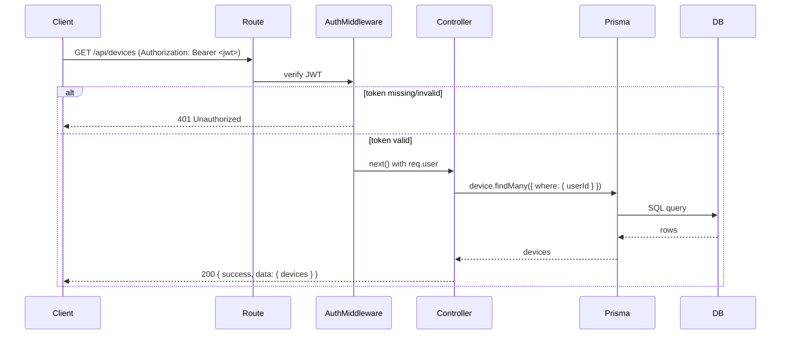
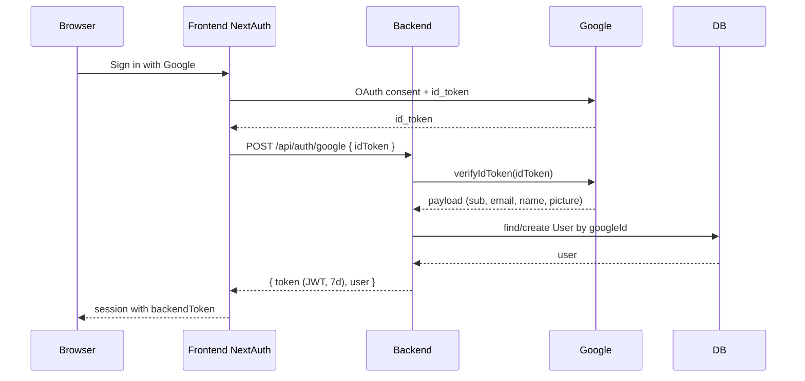
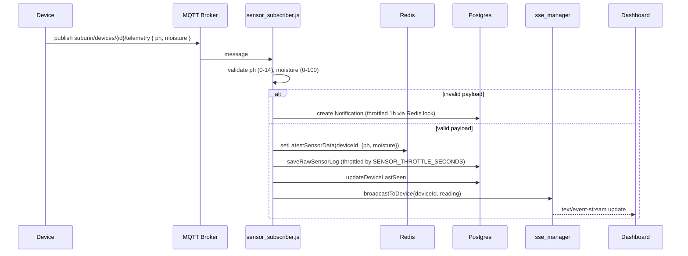
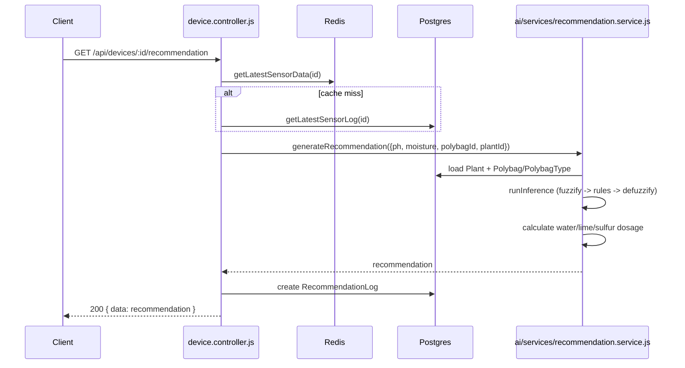

# API Flow

## Authenticated REST Request

Most endpoints require a JWT issued by `POST /api/auth/google`, sent as `Authorization: Bearer <token>` and verified by [`auth.middleware.js`](../../backend/src/middlewares/auth.middleware.js).

## Google Sign-In

## Device Telemetry (MQTT -> DB/Cache -> SSE)

## Recommendation Generation

See [error-response.md](../api/error-response.md) for the shared error envelope and [authentication.md](../api/authentication.md) for token details.
