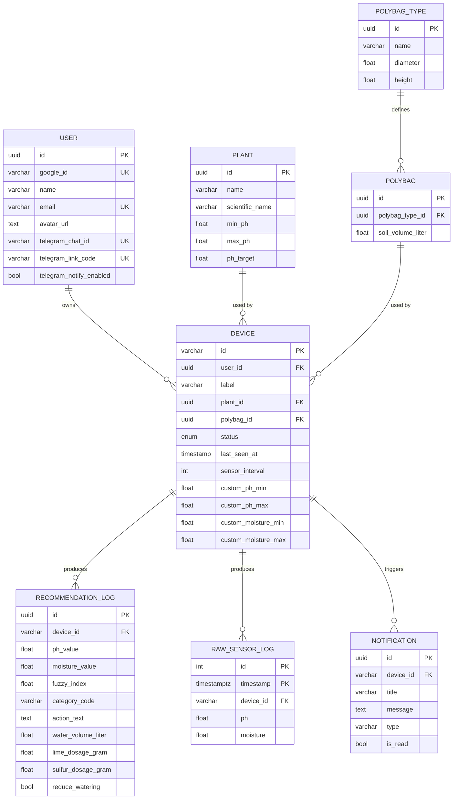

# Skema database

PostgreSQL (dihosting di Supabase), diakses melalui Prisma. Sumber skema: [`backend/prisma/schema.prisma`](../../backend/prisma/schema.prisma).

## Entitas

| Model               | Tujuan                                                                                       |
| ------------------- | -------------------------------------------------------------------------------------------- |
| `User`              | Akun yang dibuat/disinkronkan melalui Google Sign-In                                         |
| `Device`            | Unit sensor IoT terdaftar, dimiliki oleh seorang user, terhubung ke sebuah plant dan polybag |
| `Plant`             | Data referensi spesies tanaman (rentang/target toleransi pH)                                 |
| `PolybagType`       | Dimensi fisik polybag (diameter, tinggi)                                                     |
| `Polybag`           | Instance polybag yang diturunkan dari `PolybagType`, dengan volume tanah yang dihitung       |
| `RecommendationLog` | Satu hasil rekomendasi fuzzy logic, terkait dengan sebuah device                             |
| `RawSensorLog`      | Telemetri pH/kelembaban mentah, dipartisi per bulan untuk retensi/pembersihan                |
| `Notification`      | Peringatan yang ditujukan ke user, terikat pada device (misalnya data sensor tidak valid)    |

## ERD

## Catatan

- `Device.id` adalah natural key (varchar), yang mencocokkan identifier fisik perangkat alih-alih UUID yang dihasilkan otomatis, karena topik MQTT dan provisioning hardware merujuk langsung padanya.
- Relasi `Device` -> `Plant`/`Polybag` menggunakan `onDelete: Restrict`: plant atau polybag yang sedang digunakan oleh device tidak dapat dihapus, sehingga device tidak menjadi yatim (orphaned).
- `Device` -> `User` menggunakan `onDelete: Cascade`: menghapus user akan menghapus device miliknya (dan secara transitif juga recommendation log serta notifikasi terkait).
- `RawSensorLog` menggunakan kunci `(timestamp, id)` dan dipartisi berdasarkan rentang bulan di level database (dikelola oleh [`src/cron/database_cleanup_cron.js`](../../backend/src/cron/database_cleanup_cron.js)) agar penulisan telemetri berfrekuensi tinggi dan pembersihan retensi tetap murah.
- Enum `DeviceStatus`: `ACTIVE`, `INACTIVE`, `OFFLINE`.
- `User.telegramChatId` dan `User.telegramLinkCode` sama-sama bersifat nullable dan unik. `telegramLinkCode` adalah kode sekali pakai yang dihapus segera setelah webhook Telegram mengonsumsinya untuk mengisi `telegramChatId`. Lihat [api/telegram.md](../api/telegram.md).
- `User.telegramNotifyEnabled` (default `true`) mengatur perintah bot `/notifikasi on|off`; dibaca oleh `notifyDevice` untuk memutuskan apakah channel Telegram ikut dikirimi, terlepas dari `telegramChatId` sudah tertaut atau belum.
- `Device.customPhMin`/`customPhMax`/`customMoistureMin`/`customMoistureMax` (semuanya nullable, diisi lewat perintah bot `/threshold`) meng-override ambang batas notifikasi transisi kategori bawaan (hardcode `25`/`35` untuk kelembapan, `Plant.minPh`/`maxPh` untuk pH) di `mqtt/subscribers/sensor_subscriber.js`. Tidak memengaruhi perhitungan `generateRecommendation`, yang tetap selalu memakai nilai resmi `Plant`.

Lihat [database/prisma.md](../database/prisma.md) untuk konvensi query dan [database/migration.md](../database/migration.md) untuk cara perubahan skema diterapkan.
