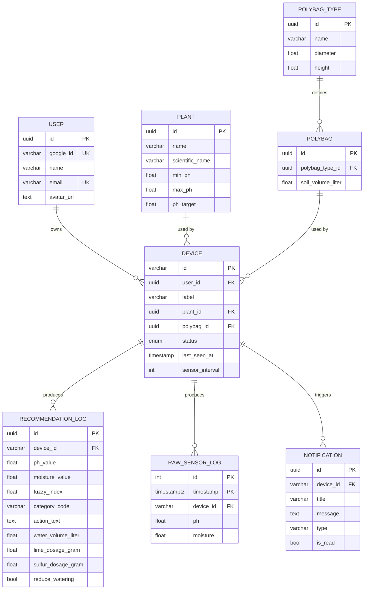

# Database Schema

PostgreSQL (hosted on Supabase), accessed via Prisma. Schema source: [`backend/prisma/schema.prisma`](../../backend/prisma/schema.prisma).

## Entities

| Model | Purpose |
|---|---|
| `User` | Account created/synced via Google Sign-In |
| `Device` | A registered IoT sensor unit, owned by a user, linked to a plant and a polybag |
| `Plant` | Plant species reference data (pH tolerance range/target) |
| `PolybagType` | Physical polybag dimensions (diameter, height) |
| `Polybag` | A polybag instance derived from a `PolybagType`, with computed soil volume |
| `RecommendationLog` | One fuzzy-logic recommendation result, tied to a device |
| `RawSensorLog` | Raw pH/moisture telemetry, partitioned by month for retention/cleanup |
| `Notification` | Device-scoped user-facing alert (e.g. invalid sensor data) |

## ERD

## Notes

- `Device.id` is a natural key (varchar), matching the physical device's identifier rather than a generated UUID, since MQTT topics and hardware provisioning reference it directly.
- `Device` -> `Plant`/`Polybag` relations use `onDelete: Restrict` — a plant or polybag in use by a device cannot be deleted, preventing orphaned devices.
- `Device` -> `User` uses `onDelete: Cascade` — deleting a user removes their devices (and transitively their recommendation logs and notifications).
- `RawSensorLog` is keyed on `(timestamp, id)` and range-partitioned by month at the database level (managed by [`src/cron/database_cleanup_cron.js`](../../backend/src/cron/database_cleanup_cron.js)) to keep high-frequency telemetry writes and retention cleanup cheap.
- `DeviceStatus` enum: `ACTIVE`, `INACTIVE`, `OFFLINE`.

See [database/prisma.md](../database/prisma.md) for query conventions and [database/migration.md](../database/migration.md) for how schema changes are applied.
