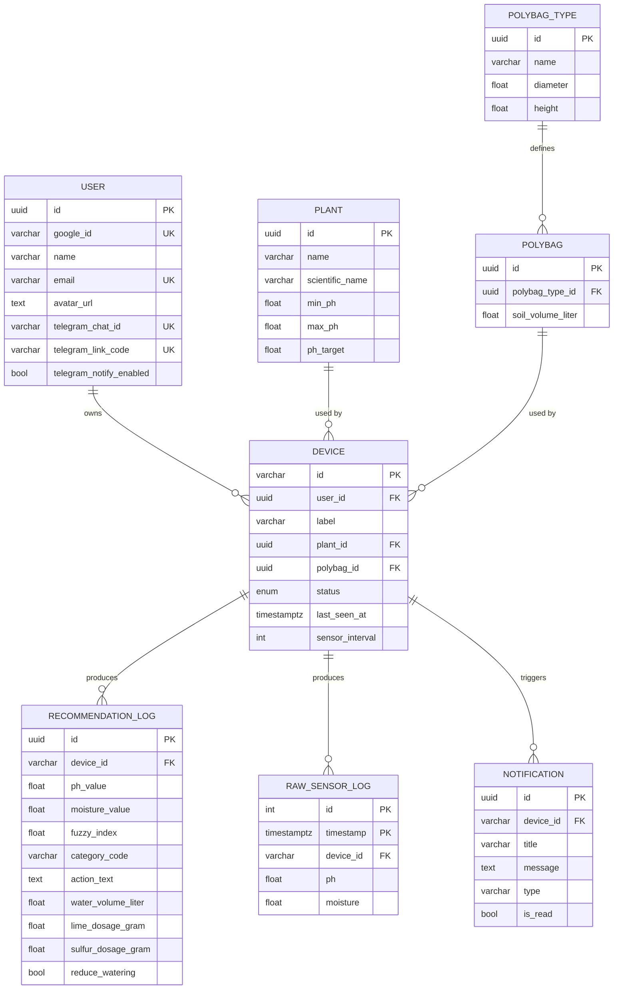

# Skema database

PostgreSQL (dihosting di Supabase), diakses melalui Prisma. Sumber skema: [`backend/prisma/schema.prisma`](../../backend/prisma/schema.prisma).

## Entitas

| Model               | Tujuan                                                                                       |
| ------------------- | -------------------------------------------------------------------------------------------- |
| `User`              | Akun yang dibuat/disinkronkan melalui Google Sign-In                                         |
| `Device`            | Unit sensor IoT terdaftar, dimiliki oleh seorang user, terhubung ke sebuah plant dan polybag |
| `Plant`             | Data referensi spesies tanaman (rentang/target toleransi pH)                                 |
| `PolybagType`       | Dimensi fisik polybag (diameter, tinggi)                                                     |
| `Polybag`           | Instance polybag yang diturunkan dari `PolybagType`, dengan volume tanah yang dihitung       |
| `RecommendationLog` | Satu hasil rekomendasi fuzzy logic, terkait dengan sebuah device                             |
| `RawSensorLog`      | Telemetri pH/kelembaban mentah, dipartisi per bulan untuk retensi/pembersihan                |
| `Notification`      | Peringatan yang ditujukan ke user, terikat pada device (misalnya data sensor tidak valid)    |

## ERD

```mermaid
erDiagram
    USER ||--o{ DEVICE : owns
    PLANT ||--o{ DEVICE : "used by"
    POLYBAG ||--o{ DEVICE : "used by"
    POLYBAG_TYPE ||--o{ POLYBAG : defines
    DEVICE ||--o{ RECOMMENDATION_LOG : produces
    DEVICE ||--o{ RAW_SENSOR_LOG : produces
    DEVICE ||--o{ NOTIFICATION : triggers

    USER {
        uuid id PK
        varchar google_id UK
        varchar name
        varchar email UK
        text avatar_url
        varchar telegram_chat_id UK
        varchar telegram_link_code UK
        bool telegram_notify_enabled
    }
    DEVICE {
        varchar id PK
        uuid user_id FK
        varchar label
        uuid plant_id FK
        uuid polybag_id FK
        enum status
        timestamptz last_seen_at
        int sensor_interval
    }
    PLANT {
        uuid id PK
        varchar name
        varchar scientific_name
        float min_ph
        float max_ph
        float ph_target
    }
    POLYBAG_TYPE {
        uuid id PK
        varchar name
        float diameter
        float height
    }
    POLYBAG {
        uuid id PK
        uuid polybag_type_id FK
        float soil_volume_liter
    }
    RECOMMENDATION_LOG {
        uuid id PK
        varchar device_id FK
        float ph_value
        float moisture_value
        float fuzzy_index
        varchar category_code
        text action_text
        float water_volume_liter
        float lime_dosage_gram
        float sulfur_dosage_gram
        bool reduce_watering
    }
    RAW_SENSOR_LOG {
        int id PK
        timestamptz timestamp PK
        varchar device_id FK
        float ph
        float moisture
    }
    NOTIFICATION {
        uuid id PK
        varchar device_id FK
        varchar title
        text message
        varchar type
        bool is_read
    }
```

## Catatan

- `Device.id` adalah natural key (varchar), yang mencocokkan identifier fisik perangkat alih-alih UUID yang dihasilkan otomatis, karena topik MQTT dan provisioning hardware merujuk langsung padanya.
- Relasi `Device` -> `Plant`/`Polybag` menggunakan `onDelete: Restrict`: plant atau polybag yang sedang digunakan oleh device tidak dapat dihapus, sehingga device tidak menjadi yatim (orphaned).
- `Device` -> `User` menggunakan `onDelete: Cascade`: menghapus user akan menghapus device miliknya (dan secara transitif juga recommendation log serta notifikasi terkait).
- `RawSensorLog` menggunakan kunci `(timestamp, id)` dan dipartisi berdasarkan rentang bulan di level database (dikelola oleh [`src/cron/database_cleanup_cron.js`](../../backend/src/cron/database_cleanup_cron.js)) agar penulisan telemetri berfrekuensi tinggi dan pembersihan retensi tetap murah.
- Enum `DeviceStatus`: `ACTIVE`, `INACTIVE`, `OFFLINE`.
- `User.telegramChatId` dan `User.telegramLinkCode` sama-sama bersifat nullable dan unik. `telegramLinkCode` adalah kode sekali pakai yang dihapus segera setelah webhook Telegram mengonsumsinya untuk mengisi `telegramChatId`. Lihat [api/telegram.md](../api/telegram.md).
- `User.telegramNotifyEnabled` (default `true`) mengatur perintah bot `/notifikasi on|off`; dibaca oleh `notifyDevice` untuk memutuskan apakah channel Telegram ikut dikirimi, terlepas dari `telegramChatId` sudah tertaut atau belum.

- Semua kolom waktu bertipe `timestamptz(6)` (`@db.Timestamptz(6)`), termasuk `created_at`, `updated_at`, `last_seen_at`, dan `raw_sensor_logs.timestamp`.
- Menghapus device atau akun juga menghapus `raw_sensor_logs` miliknya di dalam satu `prisma.$transaction` (tanpa FK, jadi tidak ikut cascade). Skrip `npm run db:check-orphans` melaporkan baris yatim.

## Index

Semua index dideklarasikan dengan `@@index` di `schema.prisma` (wajib, karena `prisma db push` menghapus index yang tidak dideklarasikan):

| Tabel                | Index                                                 |
| -------------------- | ----------------------------------------------------- |
| `raw_sensor_logs`    | `idx_raw_sensor_logs_device_timestamp (device_id, timestamp DESC)` |
| `devices`            | `idx_devices_user_id`, `idx_devices_plant_id`, `idx_devices_polybag_id` |
| `notifications`      | `idx_notifications_device_created (device_id, created_at DESC)` |
| `recommendation_logs`| `idx_recommendation_logs_device_created (device_id, created_at DESC)` |
| `polybags`           | `idx_polybags_polybag_type_id`                        |

## Constraint (CHECK)

Dikelola lewat SQL manual [`prisma/manual/001_check_constraints.sql`](../../backend/prisma/manual/001_check_constraints.sql), tidak dimodelkan Prisma. Field Prisma tetap `String`/`Float`.

| Tabel                 | Aturan                                                                            |
| --------------------- | --------------------------------------------------------------------------------- |
| `notifications`       | `type` hanya `'warning'`, `'info'`, `'success'`                                   |
| `recommendation_logs` | `category_code` cocok `^C[1-9]$`; `ph_value` 0-14; `moisture_value` 0-100; `water_volume_liter`, `lime_dosage_gram`, `sulfur_dosage_gram` >= 0; `fuzzy_index` 0-8 |
| `raw_sensor_logs`     | `ph` 0-14; `moisture` 0-100 (berlaku di semua partisi)                            |
| `plants`              | `min_ph`, `max_ph` 0-14; `min_ph < max_ph`; `ph_target` di antara keduanya        |
| `devices`             | `sensor_interval > 0`                                                             |
| `polybag_types`       | `diameter > 0`, `height > 0`                                                      |
| `polybags`            | `soil_volume_liter > 0`                                                           |

Enum Postgres sengaja tidak dipakai untuk `type` dan `category_code`: `db push` dapat menganggap perubahan `varchar` ke enum berisiko kehilangan data dan menggagalkan deploy, dan tidak kompatibel mundur dengan kode lama selama jendela deploy.

## Row Level Security

RLS diaktifkan (tanpa policy, tanpa `FORCE`) pada semua tabel dan seluruh partisi `raw_sensor_logs` lewat [`002_row_level_security.sql`](../../backend/prisma/manual/002_row_level_security.sql). Backend memakai role dengan `BYPASSRLS` sehingga tidak terpengaruh. Partisi baru otomatis diaktifkan RLS-nya oleh `database_cleanup_cron.js`.

Lihat [database/prisma.md](../database/prisma.md) untuk konvensi query dan [database/migration.md](../database/migration.md) untuk cara perubahan skema diterapkan.
