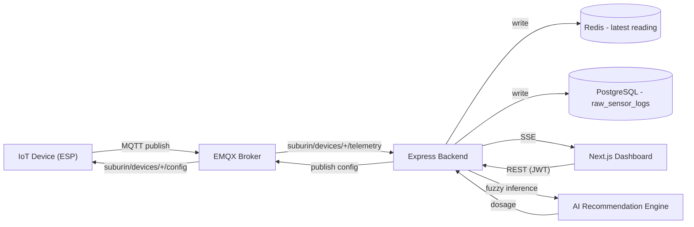

# System Design

## Overview

Subur.in is an IoT-based smart plant monitoring and recommendation platform. An ESP-class device measures soil pH and moisture, publishes the readings over MQTT, and the backend turns those readings into actionable irrigation/fertilization advice using a Mamdani fuzzy-logic engine. Users manage their devices and view recommendations through a Next.js web dashboard.

## Components

| Component | Tech | Responsibility |
|---|---|---|
| IoT device | ESP32/ESP8266 (external) | Reads soil pH/moisture, publishes telemetry over MQTT |
| MQTT broker | EMQX Cloud (managed) | Transport between device and backend |
| Backend API | Node.js, Express, Prisma | Auth, device/plant/polybag CRUD, fuzzy recommendation engine, SSE, cron jobs, Prometheus metrics |
| Database | PostgreSQL (Supabase) | Users, devices, plants, polybags, recommendation logs, raw sensor logs (partitioned) |
| Cache | Redis (Upstash) | Latest sensor readings per device, throttling, dedupe locks |
| Frontend | Next.js 16 (App Router), NextAuth v5 | Dashboard for monitoring, device management, recommendations |
| Deployment | Docker, GHCR, GitHub Actions, VPS | Containers built by CI and pulled onto a VPS running docker-compose |

## High-Level Flow

## Backend Subsystems

- **HTTP API** (`src/routes`, `src/controllers`) — REST resources for auth, users, devices, plants, polybags, recommendations, notifications, and sensor reads. See [api-flow.md](api-flow.md).
- **MQTT layer** (`src/mqtt`) — subscribes to device telemetry, validates payloads, writes to Redis + Postgres, triggers notifications on invalid data, and publishes config changes (sensor interval) back to devices.
- **AI recommendation engine** (`src/ai`) — a Mamdani fuzzy-logic system (pH x moisture -> 9-category action) plus deterministic dosage calculators for irrigation water, dolomite lime, and elemental sulfur. Pure functions, no I/O, safe to unit test in isolation ([`src/ai/__tests__`](../../backend/src/ai/__tests__)).
- **SSE manager** (`src/sse`) — keeps per-device `EventSource` client lists in memory and broadcasts live sensor + notification events to connected dashboards.
- **Cron jobs** (`src/cron`) — monthly Postgres partition management/cleanup for `raw_sensor_logs`, and a downsampling job.
- **Repositories** (`src/repositories`) — thin data-access layer over Prisma (Postgres) and Redis for sensor reads.

## Why Fuzzy Logic

Soil pH and moisture interact non-linearly with plant health — a single hard threshold per variable misses combined states (e.g. "slightly acidic and moderately dry" needs a different response than "very acidic and very dry"). A Mamdani fuzzy inference system lets the rule base ([`src/ai/core/rules.js`](../../backend/src/ai/core/rules.js)) express these combinations declaratively, and the defuzzified output index (0-8) maps to one of 9 action categories interpreted in [`src/ai/utils/interpreter.js`](../../backend/src/ai/utils/interpreter.js). See [ADR-004](../decisions/adr-004-fuzzy-logic-engine.md).

## Related Docs

- [Folder structure](folder-structure.md)
- [Database schema](database-schema.md)
- [API flow](api-flow.md)
- [Backend authentication](../backend/authentication.md)
