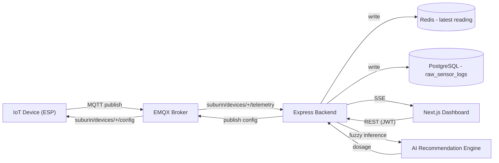

# Desain sistem

## Gambaran umum

Subur.in adalah platform pemantauan dan rekomendasi tanaman pintar berbasis IoT. Perangkat kelas ESP mengukur pH tanah dan kelembaban, mempublikasikan pembacaan tersebut melalui MQTT, dan backend mengubah pembacaan tersebut menjadi saran irigasi/pemupukan yang dapat ditindaklanjuti menggunakan mesin fuzzy logic Mamdani. Pengguna mengelola perangkat mereka dan melihat rekomendasi melalui dashboard web Next.js.

## Komponen

| Komponen | Teknologi | Tanggung Jawab |
|---|---|---|
| Perangkat IoT | ESP32/ESP8266 (eksternal) | Membaca pH/kelembaban tanah, mempublikasikan telemetri melalui MQTT |
| MQTT broker | EMQX Cloud (terkelola) | Transport antara perangkat dan backend |
| Backend API | Node.js, Express, Prisma | Auth, CRUD device/plant/polybag, mesin rekomendasi fuzzy, SSE, cron job |
| Database | PostgreSQL (Supabase) | Users, devices, plants, polybags, recommendation log, raw sensor log (dipartisi) |
| Cache | Redis (self-hosted, client ioredis) | Pembacaan sensor terbaru per device, throttling, lock dedupe |
| Notifikasi | Telegram Bot API | Kanal push untuk peringatan device, berdampingan dengan SSE in-app + riwayat notifikasi |
| Frontend | Next.js 16 (App Router), NextAuth v5 | Dashboard untuk pemantauan, manajemen device, rekomendasi |
| Deployment | Docker, GHCR, GitHub Actions, VPS | Container dibangun oleh CI dan ditarik ke VPS yang menjalankan docker-compose |

## Alur tingkat tinggi

## Subsistem backend

- **HTTP API** (`src/routes`, `src/controllers`): resource REST untuk auth, users, devices, plants, polybags, recommendations, notifications, dan pembacaan sensor. Lihat [api-flow.md](api-flow.md).
- **Lapisan MQTT** (`src/mqtt`): berlangganan telemetri perangkat, memvalidasi payload, menulis ke Redis + Postgres, memicu notifikasi saat data tidak valid, dan mempublikasikan perubahan konfigurasi (interval sensor) kembali ke perangkat.
- **Mesin rekomendasi AI** (`src/ai`): sistem fuzzy logic Mamdani (pH x kelembaban -> 9 kategori aksi) ditambah kalkulator dosis deterministik untuk air irigasi, kapur dolomit, dan sulfur elemental. Fungsi murni, tanpa I/O, aman untuk diuji secara terisolasi ([`src/ai/__tests__`](../../backend/src/ai/__tests__)).
- **SSE manager** (`src/sse`): menyimpan daftar client `EventSource` per device di memori dan menyiarkan event sensor langsung + notifikasi ke dashboard yang terhubung.
- **Dispatch notifikasi** (`src/services/notification.service.js`, `src/services/telegram.service.js`): satu titik masuk (`notifyDevice`) yang digunakan setiap call site pembuat notifikasi, menyebarkan notifikasi ke Postgres, SSE, dan Telegram (jika pemilik device telah menautkan akunnya) dalam satu panggilan. Lihat [api/telegram.md](../api/telegram.md).
- **Cron job** (`src/cron`): manajemen/pembersihan partisi Postgres bulanan untuk `raw_sensor_logs`, dan job downsampling.
- **Repositories** (`src/repositories`): lapisan akses data tipis di atas Prisma (Postgres) dan Redis untuk pembacaan sensor.

## Mengapa fuzzy logic

pH tanah dan kelembaban berinteraksi secara non-linear dengan kesehatan tanaman. Satu ambang batas tegas per variabel akan melewatkan kondisi gabungan (misalnya "sedikit asam dan cukup kering" memerlukan respons berbeda dibanding "sangat asam dan sangat kering"). Sistem inferensi fuzzy Mamdani memungkinkan rule base ([`src/ai/core/rules.js`](../../backend/src/ai/core/rules.js)) mengekspresikan kombinasi ini secara deklaratif, dan indeks output hasil defuzzifikasi (0-8) dipetakan ke salah satu dari 9 kategori aksi yang diinterpretasikan di [`src/ai/utils/interpreter.js`](../../backend/src/ai/utils/interpreter.js). Lihat [ADR-004](../decisions/adr-004-fuzzy-logic-engine.md).

## Dokumen terkait

- [Struktur folder](folder-structure.md)
- [Skema database](database-schema.md)
- [Alur API](api-flow.md)
- [Autentikasi backend](../backend/authentication.md)
