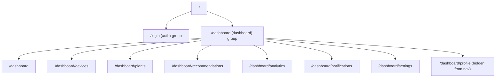

# Routing

Next.js 16 App Router with two route groups separating public and protected areas.

## Route Groups

| Group | Path prefix | Layout auth |
|---|---|---|
| `(auth)` | `/login` | Public |
| `(dashboard)` | `/dashboard/*` | Enforced server-side in `layout.tsx` |

## Pages

| Route | File | Notes |
|---|---|---|
| `/login` | `app/(auth)/login/page.tsx` | Client component, triggers `signIn("google", { callbackUrl: "/dashboard" })` |
| `/dashboard` | `app/(dashboard)/dashboard/page.tsx` | Overview |
| `/dashboard/devices` | `.../devices/page.tsx` | Device list/claim/manage |
| `/dashboard/plants` | `.../plants/page.tsx` | Plant reference browsing |
| `/dashboard/recommendations` | `.../recommendations/page.tsx` | Recommendation history/simulate |
| `/dashboard/analytics` | `.../analytics/page.tsx` | Charts over sensor history |
| `/dashboard/notifications` | `.../notifications/page.tsx` | Notification inbox |
| `/dashboard/settings` | `.../settings/page.tsx` | App/account settings |
| `/dashboard/profile` | `.../profile/page.tsx` | Profile edit; reachable but hidden from the nav (`hidden: true` in `navConfig.ts`) |
| `/api/nextauth/[...nextauth]` | `app/api/nextauth/[...nextauth]/route.ts` | NextAuth v5 catch-all handler |

## Auth Enforcement

`app/(dashboard)/layout.tsx` is an **async server component** that calls `auth()` (NextAuth) on every request to a `/dashboard/*` route and `redirect("/login")` if there is no session — this is the single enforcement point; individual dashboard pages do not need their own auth checks. The layout also eagerly fetches a fresh user profile from the backend (`GET /api/users/me`) to avoid showing stale name/avatar from the JWT.

Adding a new dashboard page: create `app/(dashboard)/dashboard/<route>/page.tsx` and add an entry to [`navConfig.ts`](../../frontend/src/components/dashboard/navConfig.ts) — the layout's auth check applies automatically since the page lives inside the `(dashboard)` group.
