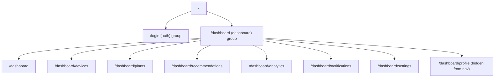

# Routing

Next.js 16 App Router dengan dua route group yang memisahkan area publik dan area terproteksi.

## Route Groups

| Group | Prefix Path | Auth Layout |
|---|---|---|
| `(auth)` | `/login` | Publik |
| `(dashboard)` | `/dashboard/*` | Ditegakkan di sisi server dalam `layout.tsx` |

## Halaman

| Route | File | Catatan |
|---|---|---|
| `/login` | `app/(auth)/login/page.tsx` | Client component, memicu `signIn("google", { callbackUrl: "/dashboard" })` |
| `/dashboard` | `app/(dashboard)/dashboard/page.tsx` | Overview |
| `/dashboard/devices` | `.../devices/page.tsx` | Daftar/klaim/kelola device |
| `/dashboard/plants` | `.../plants/page.tsx` | Penelusuran referensi tanaman |
| `/dashboard/recommendations` | `.../recommendations/page.tsx` | Riwayat rekomendasi/simulasi |
| `/dashboard/analytics` | `.../analytics/page.tsx` | Chart atas riwayat sensor |
| `/dashboard/notifications` | `.../notifications/page.tsx` | Kotak masuk notifikasi |
| `/dashboard/settings` | `.../settings/page.tsx` | Pengaturan aplikasi/akun |
| `/dashboard/profile` | `.../profile/page.tsx` | Edit profil; dapat diakses tetapi disembunyikan dari nav (`hidden: true` di `navConfig.ts`) |
| `/api/nextauth/[...nextauth]` | `app/api/nextauth/[...nextauth]/route.ts` | Handler catch-all NextAuth v5 |

## Penegakan Autentikasi

`app/(dashboard)/layout.tsx` adalah **async server component** yang memanggil `auth()` (NextAuth) pada setiap request ke route `/dashboard/*` dan melakukan `redirect("/login")` jika tidak ada sesi, dan menjadi satu-satunya titik penegakan (enforcement); halaman dashboard individual tidak perlu memiliki pemeriksaan auth sendiri. Layout ini juga secara aktif mengambil profil pengguna terbaru dari backend (`GET /api/users/me`) untuk menghindari tampilnya nama/avatar yang usang dari JWT.

Menambahkan halaman dashboard baru: buat `app/(dashboard)/dashboard/<route>/page.tsx` dan tambahkan entri ke [`navConfig.ts`](../../frontend/src/components/dashboard/navConfig.ts); pemeriksaan auth pada layout otomatis berlaku karena halaman tersebut berada di dalam group `(dashboard)`.
