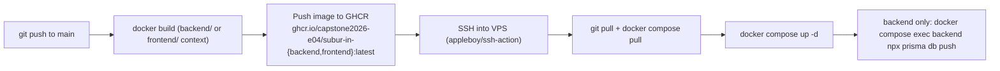

# Deployment

## Pipeline

Setiap aplikasi memiliki workflow GitHub Actions sendiri, dipicu saat push ke `main` ketika file di bawah folder aplikasi tersebut berubah:

- [`.github/workflows/deploy-backend.yml`](../../.github/workflows/deploy-backend.yml): dipicu pada `backend/**`
- [`.github/workflows/deploy-frontend.yml`](../../.github/workflows/deploy-frontend.yml): dipicu pada `frontend/**`

Kedua workflow:
1. Membangun image Docker dari `Dockerfile` masing-masing aplikasi.
2. Mendorong image tersebut ke GitHub Container Registry (GHCR) sebagai `:latest`.
3. SSH ke VPS, `git pull` repo (untuk mendapatkan `docker-compose.yml` terbaru), pull image baru, dan `docker compose up -d` untuk service tersebut.

Kedua workflow berbagi concurrency group `deploy-suburin-vps` dengan `cancel-in-progress: false`, sehingga deploy backend dan frontend yang dipicu berdekatan waktu akan mengantre dan berjalan satu per satu terhadap VPS yang dibagikan, alih-alih saling bertabrakan. Skrip deploy juga berjalan di bawah `set -euo pipefail`, sehingga langkah mana pun yang gagal (login gagal, `git pull` gagal, `prisma db push` gagal) akan menggagalkan seluruh job alih-alih diam-diam melanjutkan.

Workflow backend juga menjalankan `prisma db push --skip-generate` terhadap database produksi setelah redeploy, sehingga perubahan schema di `prisma/schema.prisma` diterapkan secara otomatis pada setiap deploy backend.

Build frontend meneruskan `NEXT_PUBLIC_API_URL_PROD` sebagai Docker build arg (dari Actions variable repo `vars.NEXT_PUBLIC_API_URL_PROD`), karena Next.js menyisipkan (inline) nilai `NEXT_PUBLIC_*` pada saat build.

## Topologi Runtime

[`docker-compose.yml`](../../docker-compose.yml) berjalan di VPS dan mengharapkan `backend/.env` dan `frontend/.env.local` sudah ada di sana (tidak dikirim oleh CI, dikelola secara manual di server):

| Service | Image | Port Host | Port Container |
|---|---|---|---|
| `backend` | `ghcr.io/capstone2026-e04/subur-in-backend:latest` | `127.0.0.1:3000` | `3000` |
| `frontend` | `ghcr.io/capstone2026-e04/subur-in-frontend:latest` | `127.0.0.1:3001` | `3000` |

Keduanya terikat hanya ke `127.0.0.1`; reverse proxy (bukan bagian dari repo ini) diharapkan untuk melakukan terminasi TLS dan merutekan traffic publik ke port-port ini.

## Secret/Variable GitHub yang Diperlukan

| Nama | Digunakan oleh |
|---|---|
| `VPS_HOST`, `VPS_USER`, `VPS_SSH_KEY` | SSH ke target deploy |
| `VPS_DEPLOY_PATH` | Direktori di VPS yang berisi `docker-compose.yml` |
| `GHCR_USERNAME`, `GHCR_PAT` | Login Docker di VPS untuk menarik image GHCR privat |
| `vars.NEXT_PUBLIC_API_URL_PROD` | Ditanamkan ke dalam build frontend |

`GITHUB_TOKEN` (disediakan otomatis) digunakan untuk mendorong image dari runner Actions itu sendiri.

## Deploy Manual / Rollback

Untuk melakukan redeploy tanpa perubahan kode (misalnya setelah memperbaiki secret), jalankan ulang workflow terkait dari tab Actions, atau SSH ke VPS dan jalankan perintah `docker compose pull && docker compose up -d <service>` yang sama secara manual. Tidak ada rollback otomatis: pin/re-tag image sebelumnya di GHCR dan jalankan ulang `docker compose up -d` dengan tag tersebut jika perlu melakukan revert.
