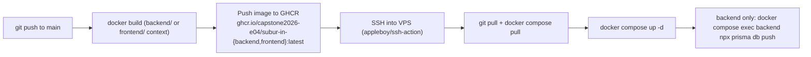

# Deployment

## Pipeline

Each app has its own GitHub Actions workflow, triggered on push to `main` when files under that app's folder change:

- [`.github/workflows/deploy-backend.yml`](../../.github/workflows/deploy-backend.yml) — triggers on `backend/**`
- [`.github/workflows/deploy-frontend.yml`](../../.github/workflows/deploy-frontend.yml) — triggers on `frontend/**`

Both workflows:
1. Build a Docker image from the app's own `Dockerfile`.
2. Push it to GitHub Container Registry (GHCR) as `:latest`.
3. SSH into the VPS, `git pull` the repo (for the latest `docker-compose.yml`), pull the new image, and `docker compose up -d` that one service.

The backend workflow additionally runs `prisma db push --skip-generate` against the production database after redeploying, so schema changes in `prisma/schema.prisma` are applied automatically on every backend deploy.

The frontend build passes `NEXT_PUBLIC_API_URL_PROD` as a Docker build arg (from the repo's `vars.NEXT_PUBLIC_API_URL_PROD` Actions variable), since Next.js inlines `NEXT_PUBLIC_*` values at build time.

## Runtime Topology

[`docker-compose.yml`](../../docker-compose.yml) runs on the VPS and expects `backend/.env` and `frontend/.env.local` to already exist there (not shipped by CI — managed manually on the server):

| Service | Image | Host port | Container port |
|---|---|---|---|
| `backend` | `ghcr.io/capstone2026-e04/subur-in-backend:latest` | `127.0.0.1:3000` | `3000` |
| `frontend` | `ghcr.io/capstone2026-e04/subur-in-frontend:latest` | `127.0.0.1:3001` | `3000` |

Both are bound to `127.0.0.1` only — a reverse proxy (not part of this repo) is expected to terminate TLS and route public traffic to these ports.

## Required GitHub Secrets/Variables

| Name | Used by |
|---|---|
| `VPS_HOST`, `VPS_USER`, `VPS_SSH_KEY` | SSH into the deploy target |
| `VPS_DEPLOY_PATH` | Directory on the VPS containing `docker-compose.yml` |
| `GHCR_USERNAME`, `GHCR_PAT` | Docker login on the VPS to pull private GHCR images |
| `vars.NEXT_PUBLIC_API_URL_PROD` | Baked into the frontend build |

`GITHUB_TOKEN` (auto-provided) is used to push images from the Actions runner itself.

## Manual Deploy / Rollback

To redeploy without a code change (e.g. after fixing a secret), re-run the relevant workflow from the Actions tab, or SSH into the VPS and run the same `docker compose pull && docker compose up -d <service>` commands manually. There is no automated rollback — pin/re-tag a previous image in GHCR and re-run `docker compose up -d` with that tag if you need to revert.
